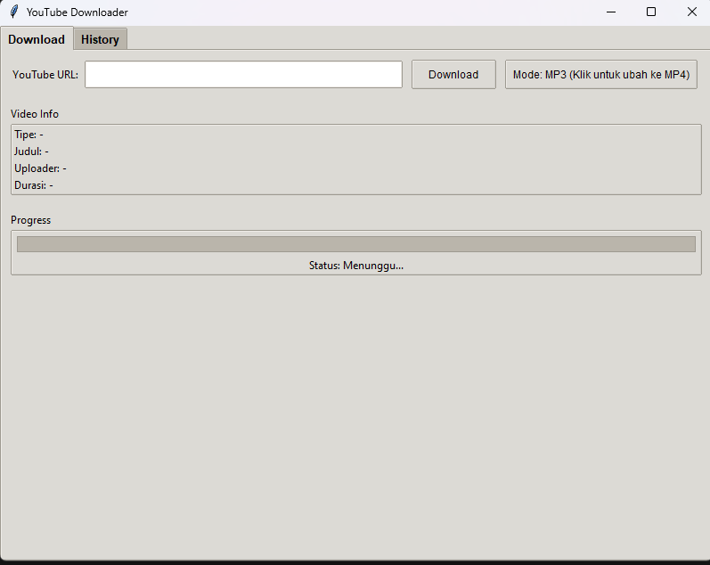
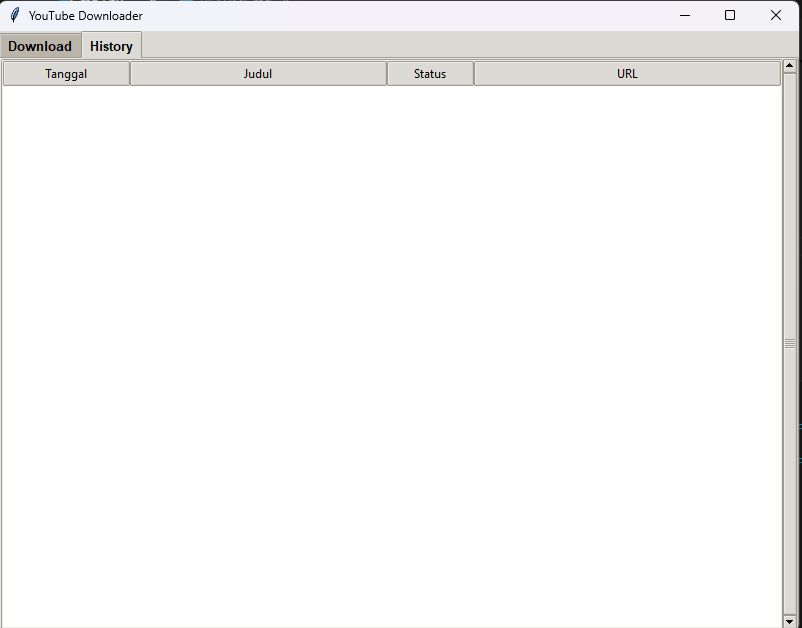

---

## 1. Overview Aplikasi

Aplikasi ini merupakan program desktop berbasis **Tkinter** yang memungkinkan pengguna untuk mengunduh video atau audio dari YouTube dengan menggunakan library **yt_dlp**. Fitur utama aplikasi ini meliputi:

- **Mode Unduhan:** Pengguna dapat memilih antara mengunduh sebagai audio (MP3) atau video (MP4).  
- **Antarmuka Graphical (GUI):** Dibangun menggunakan Tkinter dengan tampilan tab (Notebook) yang terdiri atas tab _Download_ dan _History_.  
- **Informasi Video:** Menampilkan informasi video (atau playlist) seperti judul, uploader, tipe, dan durasi.  
- **Progress dan Status:** Terdapat progress bar dan status label untuk memantau proses unduhan.  
- **Riwayat Unduhan:** Setiap unduhan disimpan ke dalam file JSON sehingga pengguna dapat melihat riwayat unduhan melalui tab _History_.  
- **Threading dan Queue:** Proses unduhan dilakukan di thread terpisah sehingga antarmuka tetap responsif. Komunikasi antar thread menggunakan objek _queue_ untuk update UI secara thread-safe.

---

## 2. Persyaratan dan Download yang Diperlukan

Sebelum menjalankan aplikasi ini, pastikan telah memenuhi beberapa persyaratan berikut:

1. **Python 3.x:**  
   Pastikan Python versi 3.x sudah terinstal pada komputer Anda. Python dapat diunduh dari situs resminya (https://www.python.org/).

2. **Tkinter:**  
   Modul Tkinter biasanya sudah terinstal bersama Python. Jika tidak, sesuaikan dengan cara instalasi sesuai sistem operasi yang digunakan.

3. **yt_dlp:**  
   Library untuk mengunduh video/audio dari YouTube. Install melalui pip dengan perintah berikut:
   ```
   pip install yt-dlp
   ```

4. **FFmpeg:**  
   Untuk mendukung proses konversi audio ke format MP3, aplikasi ini membutuhkan FFmpeg.  
   - Download FFmpeg dari [ffmpeg.org](https://ffmpeg.org/).  
   - Pastikan executable FFmpeg telah ditambahkan ke variabel PATH sistem sehingga dapat diakses secara global.

---

## 3. Cara Menjalankan Aplikasi

Berikut langkah-langkah untuk menjalankan program:

1. **Simpan Kode:**  
   Simpan seluruh kode yang disediakan ke dalam sebuah file Python, misalnya `youtube_downloader.py`.

2. **Buka Terminal / Command Prompt:**  
   Arahkan ke direktori di mana file `youtube_downloader.py` berada.

3. **Jalankan Program:**  
   Ketik perintah berikut untuk menjalankan aplikasi:
   ```
   python youtube_downloader.py
   ```
   Setelah dijalankan, antarmuka GUI aplikasi akan muncul.

   
   

---

## 4. Penjelasan Kode Secara Detail

### 4.1. Impor Library
```python
import tkinter as tk
from tkinter import ttk, messagebox, filedialog
import threading
import queue
import json
import os
from datetime import datetime
import yt_dlp
from yt_dlp.utils import remove_terminal_sequences
```
- **Tkinter & ttk:** Digunakan untuk membuat antarmuka grafis.
- **threading & queue:** Untuk menjalankan proses unduhan di background agar UI tetap responsif.
- **json, os, datetime:** Untuk penyimpanan dan pengelolaan riwayat unduhan.
- **yt_dlp:** Library utama untuk mengunduh video/audio dari YouTube.

### 4.2. Kelas `YouTubeDownloaderApp`
Kelas ini merupakan inti dari aplikasi yang mengatur pembuatan antarmuka, logika unduhan, dan manajemen riwayat.

#### a. **Metode `__init__`**
- Inisialisasi jendela utama, pengaturan judul dan ukuran.
- Menetapkan mode unduhan default (MP3).
- Memanggil metode untuk membangun UI dan memuat riwayat unduhan dari file `history.json`.

#### b. **Metode `setup_ui`**
- Mengonfigurasi style Tkinter menggunakan tema `clam`.
- Membuat Notebook dengan dua tab: _Download_ dan _History_.
- Memanggil metode `setup_download_tab()` dan `setup_history_tab()` untuk membangun masing-masing tab.

#### c. **Metode `setup_download_tab`**
- **Input URL dan Tombol:**  
  Menyediakan kolom entri untuk memasukkan URL YouTube, tombol _Download_ untuk memulai proses, dan tombol _Mode_ untuk mengganti antara MP3 dan MP4.
  
- **Panel Info Video:**  
  Menampilkan informasi seperti tipe video, judul, uploader, dan durasi.
  
- **Progress dan Status:**  
  Terdapat progress bar dan label status untuk menunjukkan perkembangan unduhan.

- **Queue:**  
  Objek _queue_ digunakan untuk meng-update UI dari thread unduhan secara aman.

#### d. **Metode `setup_history_tab`**
- Menampilkan riwayat unduhan menggunakan widget Treeview yang menampilkan kolom:
  - Tanggal unduhan.
  - Judul video.
  - Status unduhan (Berhasil/Gagal).
  - URL video.

#### e. **Metode `toggle_mode`**
- Fungsi untuk mengubah mode unduhan antara MP3 dan MP4.  
- Mengubah teks pada tombol untuk mencerminkan mode yang sedang aktif.

#### f. **Metode `start_download`**
- Mengambil URL dari entri.
- Jika URL kosong, akan muncul pesan error.
- Jika URL valid, menjalankan metode `download_video` pada thread baru agar UI tidak terkunci.
- Menonaktifkan tombol _Download_ selama proses berlangsung dan meng-update status ke "Mengambil informasi video...".

#### g. **Metode `download_video`**
- **Ekstraksi Informasi:**  
  Menggunakan yt_dlp untuk mengekstrak informasi video atau playlist tanpa mengunduh.
  
- **Konfigurasi Opsi:**  
  Berdasarkan mode unduhan (MP3/MP4), opsi untuk yt_dlp disiapkan.  
  - **MP3:** Menggunakan postprocessor `FFmpegExtractAudio` untuk mengekstrak audio dengan codec mp3.  
  - **MP4:** Mengatur opsi untuk mengunduh video dan audio secara bersamaan serta menggabungkannya.
  
- **Update Informasi & Status:**  
  Meng-update panel info dan status berdasarkan apakah URL merupakan video individu atau playlist.
  
- **Pemilihan Folder Penyimpanan:**  
  Menampilkan dialog _file dialog_ untuk memilih direktori tempat menyimpan hasil unduhan.
  
- **Proses Unduhan:**  
  Melakukan proses unduhan menggunakan yt_dlp dan meng-update UI melalui _queue_.  
- **Penanganan Error:**  
  Jika terjadi kesalahan selama proses (misalnya `DownloadError` atau exception lain), error ditampilkan dan riwayat unduhan dicatat sebagai "Gagal".

#### h. **Metode `progress_hook`**
- Callback yang dipanggil secara periodik oleh yt_dlp untuk menginformasikan status unduhan.
- Mengupdate progress bar dan label status berdasarkan persentase unduhan.
- Menyesuaikan pesan ketika status berubah ke `finished` untuk menginformasikan proses pasca-unduhan (konversi atau penggabungan).

#### i. **Metode `check_queue`**
- Memeriksa _queue_ untuk setiap pesan yang dikirim oleh thread unduhan.  
- Berdasarkan jenis pesan (misalnya, update progress, update status, update info, error, atau selesai) maka UI akan diperbarui.
- Fungsi ini dipanggil secara periodik (setiap 100 ms) menggunakan `root.after`.

#### j. **Metode `update_info_panel` dan `reset_ui`**
- **update_info_panel:** Memperbarui label informasi di panel info video.
- **reset_ui:** Mereset progress bar, mengaktifkan kembali tombol _Download_, dan mengosongkan entri URL serta panel info, agar siap untuk unduhan berikutnya.

#### k. **Metode `format_duration`**
- Mengkonversi durasi video dari detik ke format HH:MM:SS sehingga lebih mudah dibaca.

#### l. **Manajemen Riwayat (History)**
- **load_history:** Membaca riwayat unduhan dari file `history.json`. Jika file tidak ada atau korup, maka dibuat list kosong.
- **add_to_history:** Menambahkan entri baru (tanggal, URL, judul, status) ke dalam riwayat, kemudian meng-update tampilan Treeview dan menyimpan ke file.
- **update_history_tree:** Menghapus isi Treeview dan mengisinya kembali dengan data dari riwayat.
- **save_history:** Menyimpan data riwayat unduhan ke file JSON.

#### m. **Bagian Utama Program**
```python
if __name__ == "__main__":
    root = tk.Tk()
    app = YouTubeDownloaderApp(root)
    root.mainloop()
```
- Membuat instance Tkinter dan memulai aplikasi dengan menjalankan `mainloop()`, sehingga aplikasi tetap berjalan dan merespons event.

---

## 5. Cara Menggunakan Aplikasi

1. **Memasukkan URL:**  
   Pada tab _Download_, masukkan URL YouTube yang ingin diunduh pada kolom "YouTube URL".

2. **Pilih Mode:**  
   - Secara default, mode unduhan adalah **MP3**.  
   - Klik tombol _Mode_ untuk mengganti antara MP3 dan MP4. Teks pada tombol akan berubah sesuai mode yang aktif.

3. **Mulai Unduhan:**  
   Klik tombol _Download_. Aplikasi akan:
   - Mengekstrak informasi video atau playlist.
   - Menampilkan informasi di panel _Video Info_.
   - Menampilkan progress unduhan melalui progress bar dan status.

4. **Pilih Lokasi Penyimpanan:**  
   Ketika diminta, pilih folder di mana hasil unduhan akan disimpan.

5. **Melihat Riwayat:**  
   Riwayat unduhan akan tercatat dan ditampilkan di tab _History_, lengkap dengan tanggal, judul, status, dan URL.

6. **Penanganan Error:**  
   Jika terjadi kesalahan (misalnya URL tidak valid atau masalah unduhan), pesan error akan muncul dan riwayat akan menandai unduhan tersebut sebagai "Gagal".

---